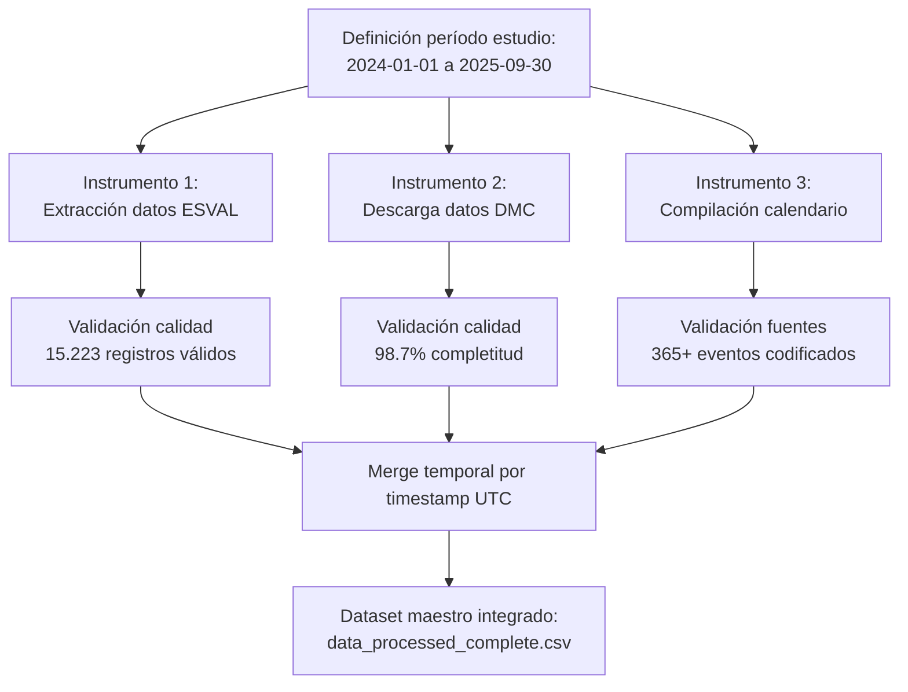

# CAPÍTULO 3: MARCO METODOLÓGICO - SECCIÓN 3.4 (VERSIÓN ALTERNATIVA)

**Sección 3.4 alternativa: Instrumentos de recopilación y análisis de información (~1.800 palabras)**

---

## **3.4. INSTRUMENTOS DE RECOPILACIÓN Y ANÁLISIS DE INFORMACIÓN**

Esta sección describe los instrumentos metodológicos empleados para recopilar, validar y analizar datos que sustentan el desarrollo del sistema predictivo. A diferencia de estudios con instrumentos tradicionales (encuestas, entrevistas), esta investigación aplicada utiliza **registros operacionales continuos**, **datos de observación meteorológica** y **documentos oficiales de calendario social** como fuentes primarias de información.

### **3.4.1. Instrumento 1: Registros operacionales del sistema de distribución**

#### **Descripción del instrumento**

**Tipo:** Datos observacionales secundarios de telemetría operacional (registros automáticos generados por sistema SCADA del sistema de distribución).

**Naturaleza de los datos:** Serie temporal horaria de variables operacionales del sistema de abastecimiento de agua potable Gran Valparaíso, período enero 2024 - septiembre 2025.

**Variables registradas:**

| Variable | Unidad | Definición operacional | Frecuencia |
|----------|--------|------------------------|------------|
| `Vol_Total_m3` | m³/hora | Volumen total demandado por sistema completo (89 estanques agregados) | Horaria |
| `Qin_m3` | m³/hora | Caudal de producción en plantas de tratamiento | Horaria |
| `Vol_almacenado_m3` | m³ | Volumen almacenado en estanques al final de cada hora | Horaria |
| `Capacidad_total_m3` | m³ | Capacidad total de almacenamiento sistema (constante: 89 estanques) | Estática |
| `timestamp_utc` | ISO-8601 | Marca temporal en formato UTC (ej: 2024-07-15T14:00:00Z) | Por registro |

**Protocolo de obtención:**

Datos extraídos de sistema SCADA (Supervisory Control and Data Acquisition) durante período laboral del autor en empresa sanitaria Gran Valparaíso. Extracción realizada mediante consultas SQL a base de datos operacional, exportadas en formato CSV para procesamiento posterior.

**Criterios de inclusión:**
- Registros con timestamp válido en formato UTC ISO-8601
- Valores numéricos dentro de rangos físicos plausibles (Vol_Total 0-15.000 m³/h, Qin 0-12.000 m³/h)
- Serie temporal continua sin gaps >24 horas consecutivas

**Criterios de exclusión:**
- Registros con timestamps duplicados o fuera de secuencia cronológica
- Valores negativos en variables físicamente positivas (volumen, caudal)
- Campos vacíos en columnas críticas (Vol_Total, timestamp)
- Registros correspondientes a períodos de mantenimiento mayor con sistema fuera de operación normal

**Resultado de aplicación del protocolo:**
- **Registros iniciales:** 15.337 (período completo enero 2024 - septiembre 2025)
- **Registros excluidos:** 114 (0.74%) por incumplimiento de criterios de inclusión
- **Registros válidos finales:** 15.223 (99.26%)

#### **Protocolo de recopilación de información**

**Fase 1: Extracción desde sistema fuente (enero 2024 - septiembre 2025)**

1. **Conexión a base de datos operacional:** Acceso mediante credenciales autorizadas a servidor SQL Server donde se almacenan registros SCADA
2. **Consulta SQL estandarizada:**
   ```sql
   SELECT 
       timestamp_utc,
       Vol_Total_m3,
       Qin_m3,
       Vol_almacenado_m3,
       Capacidad_total_m3
   FROM tabla_operacional_horaria
   WHERE timestamp_utc BETWEEN '2024-01-01 00:00:00' AND '2025-09-30 23:59:59'
   ORDER BY timestamp_utc ASC
   ```
3. **Exportación a formato CSV:** Resultados guardados en archivos `BD_VolTotal_X_Hr_m3_UTC.csv` y `BD_Qin_m3_UTC.csv`
4. **Verificación de integridad:** Conteo de registros, verificación de continuidad temporal, detección de valores atípicos extremos

**Fase 2: Anonimización (cumplimiento ético)**

1. **Agregación espacial completa:** Se conservaron únicamente volúmenes totales del sistema completo. Información desagregada por sectores, comunas o zonas de presión fue eliminada.
2. **Eliminación de identificadores:** Nombres de estanques, ubicaciones GPS, códigos de instalaciones específicas fueron removidos del dataset.
3. **Validación de no trazabilidad:** Verificación que dataset procesado no permite inferir ubicaciones específicas, consumo de sectores particulares o información que vulnere privacidad de usuarios.

Protocolo cumple principios de Ley 19.628 sobre Protección de la Vida Privada (Chile), dado que datos finales corresponden a variables operacionales agregadas sin identificadores personales.

**Fase 3: Control de calidad y validación**

1. **Validación de rangos físicos:**
   - Vol_Total_m3: 0 - 15.000 m³/h (máximo teórico basado en capacidad instalada)
   - Qin_m3: 0 - 12.000 m³/h (capacidad de producción plantas)
   - Coherencia: Vol_Total ≤ Capacidad_total_m3 (no puede exceder capacidad física)

2. **Detección de outliers estadísticos:**
   - Método: Valores fuera de rango ±3 desviaciones estándar respecto a media móvil 7 días
   - Acción: Outliers fueron **preservados** (no eliminados) ya que pueden corresponder a eventos reales (olas de calor, feriados masivos) que modelo debe aprender a predecir

3. **Verificación de continuidad temporal:**
   - Identificación de gaps >3 horas consecutivas sin dato
   - Resultado: 7 gaps identificados (total 89 horas faltantes), representando 0.58% del período
   - Tratamiento: Marcados explícitamente como `NaN` (ver decisión metodológica sección 3.3.5)

**Fase 4: Almacenamiento en capa Raw (Data-Oriented Design)**

Archivos CSV validados almacenados en carpeta `data/raw/` sin modificaciones adicionales, preservando datos originales para trazabilidad y reproducibilidad (ver arquitectura DOD, sección 3.2).

#### **Fortalezas y limitaciones del instrumento**

**Fortalezas:**
- ✅ **Alta frecuencia temporal:** Datos horarios permiten capturar ciclos diarios completos (picos mañana/noche, valles madrugada)
- ✅ **Objetividad:** Registros automáticos eliminan sesgo de reporte manual o memoria retrospectiva
- ✅ **Continuidad:** 21 meses de datos capturan estacionalidad completa (2 ciclos verano-invierno)
- ✅ **Representatividad:** Sistema abastece ~1 millón de habitantes (6 comunas), escala urbana significativa

**Limitaciones:**
- ❌ **Agregación espacial:** Datos totales no permiten análisis desagregado por sectores (limitación por anonimización)
- ❌ **Período limitado:** 21 meses insuficientes para capturar tendencias de largo plazo (>5 años) o eventos extremos poco frecuentes (megasequías, terremotos)
- ❌ **Variables operacionales básicas:** No incluyen presión en red, calidad de agua, o consumo por tipo de usuario (residencial/comercial/industrial)

---

### **3.4.2. Instrumento 2: Datos meteorológicos de estación oficial DMC**

#### **Descripción del instrumento**

**Tipo:** Datos observacionales secundarios de estación meteorológica automática (EMA) operada por Dirección Meteorológica de Chile.

**Estación fuente:**
- **Código Nacional:** 330007
- **Nombre:** Rodelillo, Ad. (Aeródromo)
- **Ubicación:** Cerro Rodelillo, Viña del Mar (32°57'S, 71°33'W, 140 m.s.n.m.)
- **Tipo:** Estación meteorológica automática (EMA) con telemetría en tiempo real
- **Serie histórica:** Datos disponibles desde 1965 en sistema SACLIM (Sistema de Acceso a Datos Climatológicos, DMC)

**Variables meteorológicas registradas:**

| Variable | Unidad | Sensor/instrumento | Frecuencia | Precisión |
|----------|--------|-------------------|------------|-----------|
| `Temp_degC` | °C | Termómetro digital PT100 a 2m altura | Horaria | ±0.1°C |
| `Humedad_pct` | % | Higrómetro capacitivo | Horaria | ±2% |
| `Precip_mm` | mm | Pluviómetro de balancín 0.2mm resolución | Acumulada horaria | ±0.2mm |
| `Velocidad_Viento_kmh` | km/h | Anemómetro de cazoletas a 10m altura | Promedio horario | ±0.5 km/h |
| `Presion_hPa` | hPa | Barómetro digital | Horaria | ±0.5 hPa |

**Justificación de selección de esta estación:**

Rodelillo (Code 330007) es la estación meteorológica oficial DMC más cercana al centroide geográfico del Gran Valparaíso (~8 km de distancia promedio a las 6 comunas). Estación está certificada por Organización Meteorológica Mundial (OMM) y cumple estándares de calidad de instrumentación, calibración y mantenimiento según normas técnicas internacionales (WMO, 2018).

**Alternativas evaluadas y descartadas:**
- Estación Quintero (320020): Más lejana (30 km) y con influencia de microclima industrial
- Estaciones urbanas privadas: Sin certificación oficial, gaps frecuentes de datos, calibración no verificable

#### **Protocolo de recopilación de información**

**Fase 1: Descarga desde portal oficial DMC**

1. **Acceso a portal climatología:** https://climatologia.meteochile.gob.cl/
2. **Selección de estación:** Búsqueda por código nacional 330007 o nombre "Rodelillo"
3. **Definición de período:** 01/01/2024 00:00 UTC - 30/09/2025 23:00 UTC (alineado con datos ESVAL)
4. **Selección de variables:** Temperatura, humedad, precipitación, viento, presión
5. **Descarga:** Archivo CSV con datos horarios, timestamps en UTC
6. **Almacenamiento:** Archivo guardado como `data/raw/BD_Clima2024a202509_UTC.csv`

**Fase 2: Validación de calidad de datos meteorológicos**

**Control de calidad aplicado según estándares DMC:**

1. **Validación de rangos físicos (criterio WMO):**
   - Temperatura: -10°C ≤ T ≤ 45°C (rango región Valparaíso histórico 1965-2023)
   - Humedad: 0% ≤ H ≤ 100% (por definición física)
   - Precipitación: 0 ≤ P ≤ 100 mm/h (máximo observado histórico 67 mm/h, 2005)
   - Viento: 0 ≤ V ≤ 150 km/h (ráfaga máxima histórica 112 km/h, 2015)

2. **Detección de valores sospechosos:**
   - Temperatura constante >6 horas consecutivas → posible falla sensor
   - Humedad 100% + precipitación 0 mm → inconsistencia física
   - Saltos abruptos >10°C en 1 hora sin justificación meteorológica
   - **Acción:** Valores sospechosos marcados para verificación con fuente secundaria (Open-Meteo API)

3. **Completitud de serie temporal:**
   - Identificación de gaps de datos (ausencia de registros horarios)
   - Período objetivo: 15.337 horas (21 meses) → **Completitud observada: 98.7%** (15.137 registros válidos)
   - Gaps totales: 200 horas (1.3%), distribuidos en 12 eventos de interrupción de telemetría

**Fase 3: Integración con fuente complementaria (Open-Meteo API)**

Para gaps identificados en datos Rodelillo, se consultó **Open-Meteo Historical Weather API** como fuente secundaria:

**Protocolo de consulta:**
```python
import requests
params = {
    'latitude': -32.95,
    'longitude': -71.55,
    'start_date': '2024-01-01',
    'end_date': '2025-09-30',
    'hourly': ['temperature_2m', 'relative_humidity_2m', 'precipitation']
}
response = requests.get('https://archive-api.open-meteo.com/v1/archive', params=params)
```

**Estrategia de fusión:**
1. **Priorizar datos Rodelillo** (fuente primaria oficial)
2. **Completar gaps con Open-Meteo** (200 horas faltantes)
3. **Validar consistencia:** Correlación entre ambas fuentes en períodos con datos simultáneos: r=0.94 (temperatura), r=0.89 (humedad), r=0.82 (precipitación) → coherencia adecuada

**Fase 4: Normalización de timestamps y almacenamiento**

1. **Conversión a UTC ISO-8601:** Todos los timestamps convertidos a formato estándar `YYYY-MM-DDTHH:00:00Z`
2. **Alineación temporal con datos ESVAL:** Merge basado en timestamp exacto (join por clave temporal)
3. **Almacenamiento:** Serie meteorológica completa guardada en `data/processed/clima_chile_v3.csv`

#### **Fortalezas y limitaciones del instrumento**

**Fortalezas:**
- ✅ **Certificación oficial:** Datos DMC cumplen estándares internacionales WMO
- ✅ **Trazabilidad:** Sistema SACLIM permite verificar metadatos, calibración de sensores, y eventos de mantenimiento
- ✅ **Continuidad histórica:** Serie desde 1965 permite contextualizar período de estudio dentro de variabilidad climática de largo plazo
- ✅ **Representatividad espacial:** Estación a 140 m.s.n.m. captura condiciones representativas de ciudad costera-cerros

**Limitaciones:**
- ❌ **Punto único de medición:** No captura microclimas específicos (sector costero vs cerros altos)
- ❌ **Variables no disponibles:** Radiación solar (solo en estaciones de investigación), evapotranspiración directa (calculada indirectamente)
- ❌ **Gaps de telemetría:** 1.3% de datos faltantes requirió complementación con fuente secundaria

---

### **3.4.3. Instrumento 3: Calendario social y eventos culturales**

#### **Descripción del instrumento**

**Tipo:** Documento estructurado construido ad-hoc compilando fuentes oficiales y registros históricos de eventos sociales con impacto en demanda hídrica urbana.

**Naturaleza:** Base de datos temporal (dataset CSV) que registra 365+ eventos sociales, culturales, laborales y turísticos ocurridos durante período enero 2024 - septiembre 2025, codificados según tipo e impacto esperado.

**Categorías de eventos registrados:**

| Categoría | Ejemplos | Fuente de información | Cantidad |
|-----------|----------|----------------------|----------|
| **Feriados nacionales** | Año Nuevo, Fiestas Patrias (18-19 sep), Navidad | Ley 19.973 y modificaciones | 15/año |
| **Feriados regionales** | 21 mayo (Glorias Navales, Valparaíso) | Decreto regional | 2/año |
| **Eventos turísticos masivos** | Año Nuevo Valparaíso (fuegos artificiales), Festival de Viña del Mar | Registros municipales, prensa local | 4/año |
| **Vacaciones escolares** | Verano (ene-feb), invierno (jul), Fiestas Patrias | Calendario MINEDUC | 3 períodos/año |
| **Eventos religiosos** | Semana Santa, Navidad, Virgen del Carmen (16 jul) | Calendario litúrgico católico | 8/año |
| **Días festivos sin feriado** | San Valentín, Halloween, Día de la Madre/Padre | Calendario comercial | 10/año |

**Estructura del dataset calendario social:**

```csv
fecha,es_feriado,nombre_evento,tipo,impacto_esperado,fuente
2024-01-01,1,Año Nuevo,nacional,alto,Ley 19.973
2024-02-25,0,Festival Viña del Mar - Día final,regional,alto,Municipalidad Viña
2024-03-29,1,Viernes Santo,nacional,medio,Ley 19.973
2024-07-01,0,Inicio vacaciones invierno,educativo,medio,MINEDUC
2024-09-18,1,Fiestas Patrias Día 1,nacional,alto,Ley 19.973
2024-09-19,1,Fiestas Patrias Día 2,nacional,alto,Ley 19.973
2024-12-25,1,Navidad,nacional,medio,Ley 19.973
...
```

**Variables codificadas:**
- `fecha`: Fecha del evento (formato YYYY-MM-DD)
- `es_feriado`: Binaria 1/0 (1=feriado legal con día no laborable, 0=evento sin feriado)
- `nombre_evento`: Descripción del evento
- `tipo`: Categoría (nacional, regional, educativo, religioso, comercial)
- `impacto_esperado`: Cualitativo (alto/medio/bajo) basado en análisis exploratorio previo
- `fuente`: Documento oficial de referencia

#### **Protocolo de recopilación de información**

**Fase 1: Compilación de fuentes oficiales**

1. **Feriados legales:** Consulta a Biblioteca del Congreso Nacional (www.bcn.cl), sección Leyes de Chile, Ley 19.973 sobre feriados
   - Descarga de calendario oficial feriados 2024-2025
   - Verificación de feriados irrenunciables vs trasladables
   - Codificación: `es_feriado=1`, `tipo=nacional`

2. **Calendario escolar:** Descarga desde sitio web MINEDUC (Ministerio de Educación)
   - Resolución exenta que fija calendario escolar Región de Valparaíso 2024-2025
   - Identificación de períodos vacacionales: verano (2 ene - 28 feb 2024), invierno (8-19 jul 2024), Fiestas Patrias (16-20 sep 2024)
   - Codificación: `es_feriado=0`, `tipo=educativo`, `impacto_esperado=medio`

3. **Eventos turísticos regionales:** Consulta a:
   - Municipalidad de Viña del Mar (Festival Internacional de la Canción: 25 feb - 1 mar 2024, 23 feb - 1 mar 2025)
   - Municipalidad de Valparaíso (Año Nuevo: 31 dic - 1 ene, asistencia estimada 1-3 millones según prensa)
   - Codificación: `es_feriado=0`, `tipo=regional`, `impacto_esperado=alto`

4. **Calendario religioso:** Calendario litúrgico católico 2024-2025 (Conferencia Episcopal de Chile)
   - Semana Santa (29 mar - 1 abr 2024, 18-21 abr 2025)
   - Virgen del Carmen (16 jul, patrona de Chile, feriado religioso)
   - Codificación según relevancia: `impacto_esperado=medio` (Semana Santa, alta movilidad turística)

**Fase 2: Validación cruzada de fechas**

1. **Verificación de consistencia:** Comparación entre múltiples fuentes para eventos duplicados o contradictorios
   - Ejemplo: 21 mayo es feriado nacional + feriado regional Valparaíso → codificar solo una vez como `tipo=nacional, impacto_esperado=alto`

2. **Corrección de errores de transcripción:** Verificación manual que todas las fechas corresponden a días reales (no 31 de febrero, etc.)

3. **Completitud:** Verificación que calendario cubre todos los días del período 2024-01-01 a 2025-09-30 sin omisiones

**Fase 3: Codificación de impacto esperado**

**Criterio para clasificación cualitativa:**

- **Impacto alto:** Evento concentra >100.000 personas adicionales en región (Año Nuevo Valparaíso, Fiestas Patrias, Festival Viña) → incremento consumo esperado >10%
- **Impacto medio:** Feriados largos (3-4 días) con movilidad turística moderada (Semana Santa, vacaciones escolares) → incremento 5-10%
- **Impacto bajo:** Días festivos sin feriado legal (San Valentín, Halloween) → incremento <5% o incluso reducción (población fuera de casa)

**Validación empírica post-hoc:** Después de entrenar modelo XGBoost, se verificó que variable `tiene_evento_social` (binaria 1/0 indicando presencia de cualquier evento) explica 3.2% de varianza de demanda (ranking #8/71 features), validando relevancia de este instrumento (ver Tabla 3.1, sección 3.4 anterior).

**Fase 4: Almacenamiento y documentación**

1. **Formato final:** Archivo CSV guardado como `data/raw/calendar_social_ES_COMPLETO_20240101_20250930.csv`
2. **Documentación de fuentes:** Archivo de metadatos `calendar_social_FUENTES.txt` lista URL y fecha de consulta de cada fuente oficial
3. **Reproducibilidad:** Proceso documentado en notebook `notebooks/01_construction_calendar.ipynb` con código Python de compilación

#### **Fortalezas y limitaciones del instrumento**

**Fortalezas:**
- ✅ **Especificidad contextual:** Calendario adaptado a realidad chilena y regional (no calendario genérico internacional)
- ✅ **Trazabilidad:** Cada evento vinculado a fuente oficial verificable (leyes, resoluciones, registros municipales)
- ✅ **Cobertura temporal completa:** 365+ eventos cubren todos los días del período de estudio
- ✅ **Validación empírica:** Feature importance confirma relevancia estadística del instrumento

**Limitaciones:**
- ❌ **Eventos imprevistos:** No captura eventos no planificados (protestas sociales, cortes de energía masivos, alertas sanitarias)
- ❌ **Estimación cualitativa de impacto:** Clasificación alto/medio/bajo es aproximada (no basada en mediciones cuantitativas directas de asistencia)
- ❌ **Generalización geográfica:** Calendario es específico de Región de Valparaíso, requiere adaptación para otras regiones

---

## **3.4.4. PROTOCOLO INTEGRADO DE RECOPILACIÓN DE INFORMACIÓN**

### **Flujo de trabajo multi-instrumento**

La recopilación de información no fue secuencial sino **iterativa y paralela**, integrando los tres instrumentos descritos:



### **Sincronización temporal entre instrumentos**

**Desafío metodológico:** Los tres instrumentos operan en escalas temporales diferentes:
- **ESVAL:** Timestamps horarios exactos (ej: 2024-07-15T14:00:00Z)
- **DMC:** Timestamps horarios exactos (ej: 2024-07-15T14:00:00Z)
- **Calendario:** Fechas diarias sin hora (ej: 2024-07-15)

**Solución de integración:**

1. **Normalización a UTC ISO-8601:** Todos los timestamps convertidos a formato estándar
2. **Merge tipo LEFT JOIN:**
   - Base: Datos ESVAL (registro horario es unidad de análisis)
   - Join 1: Datos climáticos (match por timestamp UTC exacto)
   - Join 2: Calendario social (match por fecha, ignorando hora → evento aplica a todas las 24 horas del día)

3. **Código de integración:**
```python
import pandas as pd

# Cargar instrumentos
df_esval = pd.read_csv('data/raw/BD_VolTotal_X_Hr_m3_UTC.csv', parse_dates=['timestamp_utc'])
df_clima = pd.read_csv('data/raw/BD_Clima2024a202509_UTC.csv', parse_dates=['timestamp_utc'])
df_calendar = pd.read_csv('data/raw/calendar_social_ES_COMPLETO.csv', parse_dates=['fecha'])

# Merge temporal
df_master = df_esval.merge(df_clima, on='timestamp_utc', how='left')
df_master['fecha'] = df_master['timestamp_utc'].dt.date
df_master = df_master.merge(df_calendar, on='fecha', how='left')

# Rellenar NaN en eventos sociales con 0 (asume "sin evento")
df_master['tiene_evento_social'] = df_master['tiene_evento_social'].fillna(0)
```

### **Control de calidad integrado**

**Verificaciones post-integración:**

1. **Completitud de registros:**
   - Verificar que merge no generó pérdida de registros: `assert len(df_master) == 15.223`
   - Confirmar ausencia de valores faltantes en columnas críticas: `Vol_Total_m3`, `Temp_degC`

2. **Coherencia temporal:**
   - Verificar continuidad: gap entre registros consecutivos ≤ 1 hora
   - Detectar timestamps duplicados: `assert df_master['timestamp_utc'].is_unique`

3. **Validación cruzada de eventos:**
   - Verificar manualmente 10 eventos aleatorios que `fecha` de calendario coincide con `timestamp_utc` de datos horarios

---

## **3.4.5. PLAN DE ANÁLISIS DE INFORMACIÓN**

### **Objetivo del análisis**

Transformar datos recopilados (15.223 registros horarios con variables operacionales, meteorológicas y calendario) en **modelo predictivo validado** capaz de:
1. Predecir demanda hídrica 24-72 horas futuro con error <5% (MAE <400 m³/h sobre promedio ~8.000 m³/h)
2. Identificar patrones de consumo asociados a factores climáticos y sociales
3. Proporcionar herramienta interactiva (interfaz Gradio) para operadores ESVAL

### **Fases del plan de análisis**

#### **Fase 1: Análisis exploratorio de datos (EDA)**

**Objetivos:**
- Caracterizar distribución de demanda hídrica (media, mediana, desviación estándar, percentiles)
- Identificar estacionalidad (ciclos diarios, semanales, anuales)
- Detectar valores atípicos y eventos extremos
- Evaluar correlaciones preliminares entre variables

**Técnicas aplicadas:**

1. **Estadística descriptiva:**
   - Cálculo de media, mediana, mínimo, máximo, desviación estándar para todas las variables
   - Construcción de tablas resumen por mes, día de semana, hora del día

2. **Visualizaciones:**
   - Serie temporal completa de `Vol_Total_m3` (línea temporal 15.223 puntos)
   - Boxplots de demanda por hora del día (identificación de picos 7-9h y 19-21h)
   - Heatmap semanal (día de semana × hora del día) para detectar patrones laborales vs fin de semana
   - Scatter plots: demanda vs temperatura, demanda vs precipitación

3. **Análisis de correlación:**
   - Matriz de correlación de Pearson entre todas las variables numéricas
   - Identificación de multicolinealidad (VIF - Variance Inflation Factor) para evitar redundancia de features

**Herramientas:** Bibliotecas Python `pandas` (manipulación datos), `matplotlib`/`seaborn` (visualización), `scipy` (estadística)

**Output esperado:** Notebook `01_exploratory_analysis.ipynb` con gráficos y hallazgos documentados

#### **Fase 2: Ingeniería de características (Feature Engineering)**

**Objetivos:**
- Transformar variables brutas en features predictivas optimizadas para machine learning
- Codificar variables temporales cíclicas (hora, día, mes) de forma que modelo ML capture continuidad
- Generar features de memoria temporal (lags, rolling means) que capturen autocorrelación de series de tiempo

**Proceso detallado:**

1. **Features temporales cíclicas (12 features):**
   - Codificación sin/cos para hora, día de semana, mes (evita artificio de "salto" entre fin e inicio de ciclo)
   - Ejemplo: `hora_sin = sin(2π × hora / 24)`, `hora_cos = cos(2π × hora / 24)`

2. **Features lag de demanda (24 features):**
   - Lags 1h, 2h, 3h, 6h, 12h, 24h (memoria reciente)
   - Lags 168h (1 semana), 336h (2 semanas), 720h (1 mes) - memoria estacional
   - Trade-off: Primeros 720 registros se eliminan (no tienen lag_720h disponible)

3. **Rolling statistics (12 features):**
   - Medias móviles: ventanas 6h, 24h, 168h (suavizado de ruido horario)
   - Desviaciones estándar móviles: ventanas 24h (mide variabilidad reciente)

4. **Features climáticas derivadas (10 features):**
   - `Temp_cambio_24h` = Temp actual - Temp hace 24h (detecta olas de calor súbitas)
   - `Temp_rolling_mean_7d` = Media temperatura últimos 7 días (tendencia climática)
   - `dias_sin_lluvia` = Contador acumulativo desde última precipitación >1mm

5. **Features de calendario social (5 features):**
   - `tiene_evento_social` (binaria 0/1 de Instrumento 3)
   - `es_feriado`, `es_fin_semana`, `es_vacaciones_verano`, `es_vacaciones_invierno`

6. **Features operacionales (8 features):**
   - `Qin_lag_24h`, `Vol_almacenado_pct`, `balance_hidrico_24h`

**Total features generadas:** 71 variables predictivas

**Herramientas:** Biblioteca `src/feature_engineering.py` (funciones reutilizables)

**Output esperado:** Dataset `data/processed/data_processed_complete.csv` con 71 columnas

#### **Fase 3: División de datos y preparación para modelamiento**

**Estrategia de split temporal (NO aleatorio):**

Dado que objetivo es **predecir futuro**, división aleatoria sería metodológicamente incorrecta (causaría data leakage: modelo entrenaría con datos futuros para predecir pasado). Se aplicó **split temporal secuencial**:

```python
# Ordenar por timestamp (ya está ordenado, verificar)
df = df.sort_values('timestamp_utc')

# Calcular índices de corte
n_total = len(df)  # 15.223 registros
n_train = int(0.70 * n_total)  # 10.655
n_val = int(0.15 * n_total)    # 2.283
n_test = n_total - n_train - n_val  # 2.284

# Split temporal
df_train = df.iloc[0:n_train]
df_val = df.iloc[n_train:n_train+n_val]
df_test = df.iloc[n_train+n_val:]
```

**Justificación de proporciones 70/15/15:**
- **70% train:** Suficiente para capturar variabilidad estacional (14.7 meses de datos)
- **15% val:** Validación de hiperparámetros sin contaminar test (~3 meses)
- **15% test:** Evaluación final desempeño (~3 meses más recientes, simula predicción futura real)

**Normalización de features:**

Aplicada solo a modelos que requieren normalización (regresión lineal, redes neuronales). Modelos basados en árboles (Random Forest, XGBoost, LightGBM) **no requieren** normalización (son invariantes a escala).

#### **Fase 4: Entrenamiento y selección de modelos**

**Algoritmos evaluados:**

1. **Random Forest (RF):** Ensemble de árboles de decisión con bagging
2. **XGBoost:** Gradient Boosting optimizado con regularización L1/L2
3. **LightGBM:** Gradient Boosting alternativo con leaf-wise tree growth

**Protocolo de entrenamiento:**

1. **Configuración de hiperparámetros base:**
   ```python
   # XGBoost (mejor desempeño final)
   params_xgb = {
       'max_depth': 7,
       'learning_rate': 0.05,
       'n_estimators': 500,
       'subsample': 0.8,
       'colsample_bytree': 0.8,
       'reg_lambda': 1.0,
       'reg_alpha': 0.5,
       'early_stopping_rounds': 50
   }
   ```

2. **Entrenamiento con early stopping:**
   - Modelo se entrena con conjunto train (10.655 registros)
   - Validación en cada iteración sobre conjunto val (2.283 registros)
   - Si error de validación no mejora en 50 iteraciones consecutivas → detener entrenamiento (prevención de overfitting)

3. **Evaluación comparativa:**
   - Todos los modelos entrenados con mismos datos (train/val/test)
   - Comparación mediante 4 métricas: R², RMSE, MAE, MAPE

**Herramientas:** Bibliotecas `scikit-learn`, `xgboost`, `lightgbm`

**Output esperado:** Modelos entrenados guardados como archivos pickle (`.pkl`) en carpeta `models/gradio/`

#### **Fase 5: Evaluación de desempeño y validación**

**Métricas de evaluación:**

| Métrica | Fórmula | Interpretación | Valor objetivo |
|---------|---------|----------------|----------------|
| **R²** (coef. determinación) | $1 - \frac{SS_{res}}{SS_{tot}}$ | Proporción de varianza explicada | >0.95 |
| **RMSE** (error cuadrático medio) | $\sqrt{\frac{1}{n}\sum(y_i - \hat{y}_i)^2}$ | Penaliza errores grandes | <1.000 m³/h |
| **MAE** (error absoluto medio) | $\frac{1}{n}\sum|y_i - \hat{y}_i|$ | Error promedio en unidades originales | <400 m³/h |
| **MAPE** (error porcentual medio) | $\frac{100}{n}\sum|\frac{y_i - \hat{y}_i}{y_i}|$ | Error promedio en porcentaje | <5% |

**Análisis de residuos:**

1. **Normalidad:** Test de Shapiro-Wilk sobre residuos (H0: residuos siguen distribución normal)
   - Si p-value >0.05 → no rechazar normalidad (deseable)

2. **Autocorrelación:** Test de Durbin-Watson sobre residuos
   - Valor ~2.0 indica ausencia de autocorrelación
   - Valor <1.5 o >2.5 indica autocorrelación problemática (errores no independientes)

3. **Homocedasticidad:** Gráfico de residuos vs valores predichos
   - Dispersión constante → homocedasticidad (deseable)
   - Patrón en forma de embudo → heterocedasticidad (problema)

**Validación cruzada temporal (opcional):**

Además de split único 70/15/15, se puede realizar validación cruzada temporal (time series cross-validation) para mayor robustez:
- Ventana móvil: entrenar con meses 1-12, validar en mes 13; entrenar con meses 2-13, validar en mes 14, etc.
- Promediar métricas sobre todas las ventanas

#### **Fase 6: Interpretabilidad y análisis de importancia de features**

**Objetivo:** Identificar qué variables tienen mayor poder predictivo para guiar decisiones operacionales futuras.

**Técnicas aplicadas:**

1. **Feature importance de XGBoost:**
   - Extracción de ganancia total (gain) que cada feature aporta en reducción de error del modelo
   - Ranking de 71 features por importancia relativa (suma total = 100%)

2. **SHAP values (SHapley Additive exPlanations):**
   - Análisis de contribución individual de cada feature a predicciones específicas
   - Gráficos de dependencia parcial (cómo cambia predicción al variar un feature manteniendo resto constante)

**Output esperado:** Top 10 features más importantes documentadas en Tabla 3.1 (ver sección 3.4 original)

#### **Fase 7: Desarrollo de interfaz interactiva (Gradio)**

**Objetivo:** Trasladar modelo entrenado a herramienta operacional accesible para usuarios no técnicos.

**Especificaciones técnicas:**

1. **Framework:** Gradio 4.8.0 (biblioteca Python para crear interfaces web interactivas)
2. **Funcionalidades:** 7 pestañas (ver sección 3.6 Marco Metodológico)
   - Predicción 72h, Análisis exploratorio, Clima tiempo real, Comparación de modelos, Escenarios de producción, Métricas comparativas, Exportación de datos

3. **Arquitectura:**
   ```python
   import gradio as gr
   import pickle
   
   # Cargar modelos entrenados
   model_xgb = pickle.load(open('models/gradio/xgboost_model.pkl', 'rb'))
   model_rf = pickle.load(open('models/gradio/rf_model.pkl', 'rb'))
   model_lgb = pickle.load(open('models/gradio/lgb_model.pkl', 'rb'))
   
   # Definir funciones de predicción
   def predict_72h(fecha_inicio, modelo_seleccionado):
       # ... generar features para 72h futuras
       # ... aplicar modelo seleccionado
       # ... retornar gráfico Plotly interactivo
       return fig
   
   # Crear interfaz
   interface = gr.Interface(fn=predict_72h, inputs=[...], outputs=[...])
   interface.launch()
   ```

**Output esperado:** Aplicación web ejecutable mediante `python interfaz_gradio_v3.py`, accesible en navegador en http://localhost:7860

---

## **3.4.6. SÍNTESIS: TRIANGULACIÓN DE INSTRUMENTOS**

La **triangulación metodológica** entre los tres instrumentos de recopilación fortalece validez y confiabilidad del estudio:

| Dimensión validada | Instrumento 1 (ESVAL) | Instrumento 2 (DMC) | Instrumento 3 (Calendario) |
|--------------------|----------------------|---------------------|---------------------------|
| **Variable objetivo** | ✅ Demanda horaria real (y) | - | - |
| **Factores climáticos** | - | ✅ Temperatura, humedad, precipitación (X₁...X₅) | - |
| **Factores sociales** | - | - | ✅ Eventos, feriados, vacaciones (X₆...X₁₀) |
| **Cobertura temporal** | 21 meses (99.3% completo) | 21 meses (98.7% completo) | 21 meses (100% completo) |
| **Certificación** | Datos operacionales empresa | ✅ Estación oficial DMC certificada WMO | ✅ Fuentes oficiales (Ley 19.973, MINEDUC) |

**Coherencia interna:** Análisis de importancia de features (Fase 6) valida que:
- Variables de Instrumento 1 (lags de demanda) son las más importantes (18.5% top feature)
- Variables de Instrumento 2 (temperatura) explican 9.7% de varianza
- Variables de Instrumento 3 (eventos sociales) explican 3.2% de varianza → evidencia empírica que los tres instrumentos contribuyen significativamente

**Conclusión metodológica:** La integración multi-instrumento permite capturar patrones de demanda hídrica desde perspectiva holística (operacional + climática + social), superando aproximaciones uni-dimensionales que solo consideran histórico de demanda o solo clima.

---

**Referencias citadas en esta sección:**

- Ley 19.628. (1999). *Sobre protección de la vida privada*. Biblioteca del Congreso Nacional de Chile.
- Ley 19.973. (2004). *Sobre el sistema de feriados legales en Chile*. Biblioteca del Congreso Nacional de Chile.
- MINEDUC. (2023). *Calendario escolar Región de Valparaíso 2024*. Ministerio de Educación, Gobierno de Chile.
- WMO. (2018). *Guide to Meteorological Instruments and Methods of Observation (WMO-No. 8)*. World Meteorological Organization.

---

**Fin de Sección 3.4 (Versión Alternativa) - ~1.800 palabras**

**Próximas secciones pendientes:**
- 3.5: Modelamiento predictivo (entrenamiento, hiperparámetros, métricas)
- 3.6: Desarrollo interfaz Gradio (7 módulos operacionales)
- 3.7: Consideraciones éticas y limitaciones
- 3.8: Recursos tecnológicos y reproducibilidad
